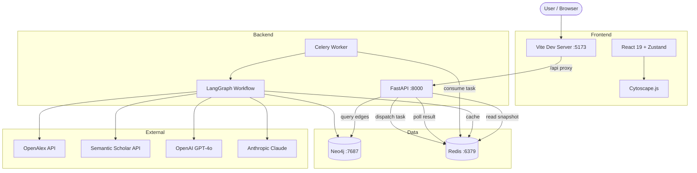
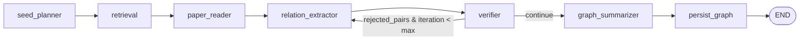
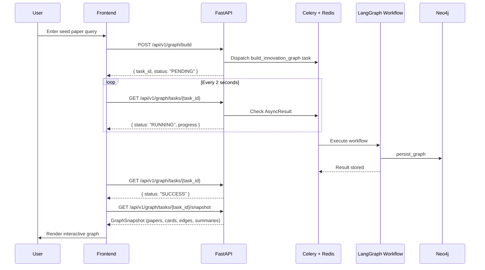
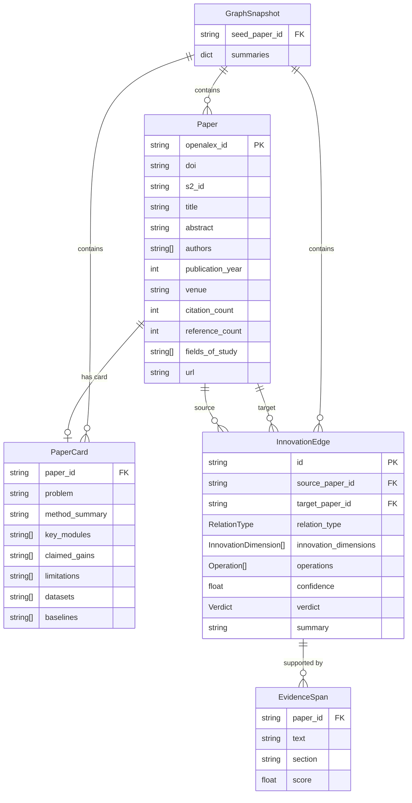
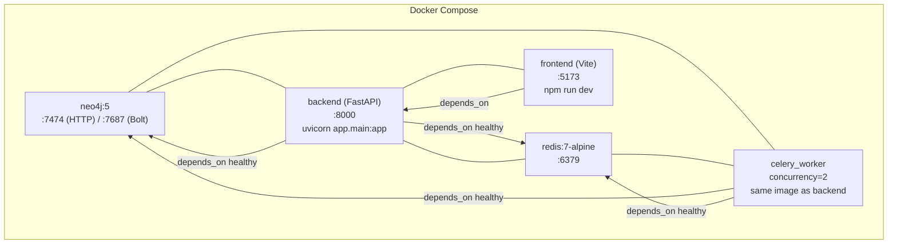

# InnoGraph — Architecture

## System Topology

## LangGraph Workflow Pipeline

| Node | Responsibility |
|---|---|
| **seed_planner** | Resolves user query (DOI/title/arXiv ID) to an OpenAlex work ID |
| **retrieval** | Fetches references + citations (OpenAlex) and recommendations (Semantic Scholar), deduplicates by title |
| **paper_reader** | LLM extracts structured PaperCards from abstracts (batches of 5) |
| **relation_extractor** | LLM classifies innovation edges using the 3-level taxonomy (batches of 5) |
| **verifier** | LLM assigns confidence scores; filters edges < 0.5 as UNSUPPORTED (batches of 5) |
| **graph_summarizer** | LLM generates lineage narratives for the graph |
| **persist_graph** | Writes papers, paper cards, and verified edges to Neo4j |

State fields annotated with `_add_list` (`raw_papers`, `paper_cards`, `candidate_edges`, `verified_edges`, `errors`) accumulate across nodes rather than overwrite.

## Frontend ↔ Backend Sequence

## Data Model

## Docker Service Topology

| Service | Image | Ports | Notes |
|---|---|---|---|
| neo4j | `neo4j:5` | 7474, 7687 | APOC plugin enabled, auth: `neo4j/innograph_dev` |
| redis | `redis:7-alpine` | 6379 | Health check via `redis-cli ping` |
| backend | `./backend` | 8000 | FastAPI with hot reload, reads `.env` |
| celery_worker | `./backend` | — | Same image, different CMD (`celery -A ...`) |
| frontend | `./frontend` | 5173 | Vite dev server, proxies `/api` to backend |

Volumes: `neo4j_data`, `neo4j_logs` for persistence.
